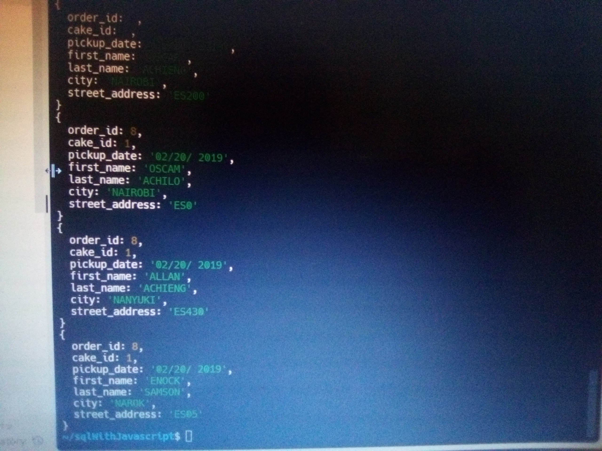

## SQLITE3 WITH JAVASCRIPT

### Description.
#### This project is aimed at demonstrating how to create and manipulate tables in a SQLite3 database using Javascript as the primary programming language. The major areas cover are How to create and connect to sqlite3 database using javascript, Creating tables, Inserting Data into the tables and querying the tables.

### Technologies Used 
#### - SQLite3 for database
#### - JavaScript Es6+ as the programming language
#### - Replit, https://replit.com/~ for code editor.
#### - https://sqliteonline.com/, onlinesqlite to inspect sql commands.

### Set-Up instructions.
#### 1. Clone the repository into a local machine or browser base coder, run the command 'npm install' to install the node packages and dependencies.
#### 2. In project's directory terminal, run 'npm install sqlite3' to install sqlite3 for the project.
#### 3. Run 'node index' to create cakes and insert data into the table. The same applies to customers.js and orders.js to create and seed customers and orders tables respectively.
#### 4. Run 'node data' in the project's directory terminal to fetch and view the data from the database. One can also use online, sqlite, https://sqliteonline.com/ to inspect sql command
#### The data should appear as shown in the picture below;

### Licence 
#### MIT Lcence
#### Copyright (c) 2022 Oscar Abuto Achieng.

##### Author: Oscar Abuto Achieng  oscarachieng94@gmail.com
#### Date: 24th November, 2022,